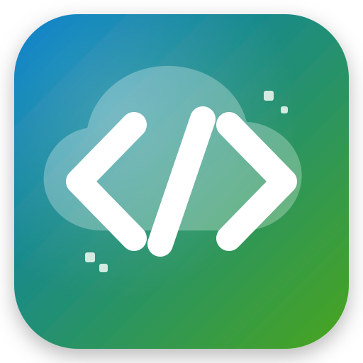

<h1>
	
	Docker Code Server with CUDA
</h1>

Code Server Docker image with cuda development env on the browser. By default, it contains:
- Ubunttu 20.04
- CUDA 11.3.0
- Code Server 4.7.0

Modfied from [works-on-my-machine/pytorch-code-server](https://github.com/works-on-my-machine/pytorch-code-server).


## News

The latest version of this image is available on [Aliyun Container Registry](https://cr.console.aliyun.com/repository/cn-shenzhen/rayleizhu/cuda-codeserver-v2/details). You can pull the image by

```
docker pull crpi-ouxc4bme22uzjqls.cn-shenzhen.personal.cr.aliyuncs.com/rayleizhu/cuda-codeserver-v2:latest
```

## Requirements
- CUDA device with compute capability 3.5 or higher
- [NVIDIA Docker Toolkit](https://github.com/ghokun/nvidia-docker-host)

## Quickstart

### Bulid image locally

```
cd docker-cuda-codeserver
bash build_locally.sh
```

You can change the version of base OS, CUDA, and Code Server in the `build_locally.sh` script.
* Go to [Nvidia's official channel on DockerHub](https://hub.docker.com/r/nvidia/cuda) for available verision number of  base OS and CUDA.
* Go to [github release page](https://github.com/coder/code-server/releases) for available version number of Code Server.

### Start container

See the `run.sh` template. You need specify correct volume mapping for `/home/coder` in container (` --volume="[HOST-MAPPING-PATH]:/home/coder/" `). In this way, files under `/home/coder` are persistent and can be accessed on the host.

Typically, the directory looks like this:

```
codesever-home/
|-- .bash_history
|-- .bashrc
|-- .config
|   `-- code-server
|       `-- config.yaml # NOTE: you can access/specifiy Code Server password in this file
`-- projects
```

### Start coding in browser
After starting container, the code server serves on `http://[you-host-ip]:8443` or `https://[you-host-ip]:8443`. If you did not specify the password in advance, access the password on host via

```bash
cat [HOST-MAPPING-PATH]/.config/code-server/config.yaml
```
or

```bash
$ docker exec -it <your_container_name> /bin/bash
$ cat ~/.config/code-server/config.yaml
```

You can install other packages such as miniconda and pytorch just like on a normal machine. As mentioned above, all modifications under `/home/coder` directory are persistent, so your environment won't lost on restart of Code Server.

### Use your own SSL certificate (optional)

By default, the coder server in the docker image will use self-signed SSL certificate. They are stored at `/home/coder/.local/share/code-server/localhost.[crt, key]`.
For security concern, you may want to use your own SSL certificate derived from CA such as [Let's Encrypt](https://letsencrypt.org/).
The simplest way to do this is overriding the two files (`/home/coder/.local/share/code-server/localhost.[crt, key]`) with the real certificate pairs you want.

## TODO
- [ ] Solve the "Workspace does not exisit" warning on first login
- [ ] Use docker compose

## References

- [coder/code-server: ipv6 support #261](https://github.com/coder/code-server/issues/261)
- [6 张图详解 Docker 容器网络配置](https://zhuanlan.zhihu.com/p/554015619)
